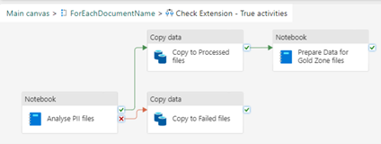

<!DOCTYPE html>
<html>

<body>
<h1>PIInovators Cloud-Native Data Solution Documentation</h1>    
<h2>Overview</h2>

PIInovators is a cloud-native data solution developed in Microsoft Fabric, integrating OpenAI for document analysis, particularly for detecting Personal Identification Information (PII) in files and images. The solution classifies documents into compliant and non-compliant categories, further categorizing them based on predefined types (Delivery, Personnel, Online, Continual, Communication). The solution is based on a medallion architecture where data is stored in three zones (Bronze, Silver, Gold) within Microsoft Fabric Lakehouse. Subsequently, the data is prepared for analytical use in Power BI reports.

<h2>Open AI models used:</h2>

<ul>
    <li>Model: GPT-4, Version: 1106-preview for files</li>
    <li>Model: GPT-4, Version: vision-preview for images</li>
</ul>

<h2>Components</h2>

<ol>
    <li><strong>External Source Integration</strong>
        <ul>
            <li><strong>Client-Side Storage:</strong> External storage on the client side where files and images are stored for analysis.</li>
        </ul>
    </li>
    <li><strong>Microsoft Fabric Lakehouse - PIInovatorsLH</strong>
        <ul>
            <li><strong>Bronze Zone</strong>
                <ul>
                    <li><strong>Raw Section:</strong>
                        <ul>
                            <li><strong>Unprocessed:</strong>
                                <ul>
                                    <li><strong>Files:</strong> Raw data for files lands here.</li>
                                    <li><strong>Images:</strong> Raw data for images lands here.</li>
                                </ul>
                            </li>
                            <li><strong>Processed:</strong>
                                <ul>
                                    <li><strong>Files:</strong> Processed files are moved here.</li>
                                    <li><strong>Images:</strong> Processed images are moved here.</li>
                                </ul>
                            </li>
                            <li><strong>Failed:</strong>
                                <ul>
                                    <li><strong>Files:</strong> Files with processing errors are moved here.</li>
                                    <li><strong>Images:</strong> Images with processing errors are moved here.</li>
                                </ul>
                            </li>
                        </ul>
                    </li>
                    <li><strong>Silver Zone</strong>
                        <ul>
                            <li><strong>Delta Tables:</strong> Populated with transformed data, including metadata, classification, sender data, category, subject, PII data, masked PII data, sender analysis, and document analysis.</li>
                        </ul>
                    </li>
                    <li><strong>Gold Zone</strong>
                        <ul>
                            <li><strong>Analytical Data Preparation:</strong>
                                <ul>
                                    <li>Parsed JSON strings from Silver Delta Tables are structured into a fixed schema in the Gold Zone for Power BI reports.</li>
                                </ul>
                            </li>
                        </ul>
                    </li>
                </ul>
            </li>
        </ul>
    </li>
    <li><strong>Objects</strong>
        <ul>
            <li><strong>Notebooks</strong>
                <ol>
                    <li><strong>00 Create Delta Tables:</strong>
                        <ul>
                            <li>Creates all the delta tables used in the project.</li>
                        </ul>
                    </li>
                    <li><strong>01 Insert Documents for Analysis:</strong>
                        <ul>
                            <li>Stores metadata for documents.</li>
                        </ul>
                    </li>
                    <li><strong>02 Ingestion Data from Text Documents and PII Analysis:</strong>
                        <ul>
                            <li>Reads, detects, and stores PII data from text into Silver Zone Delta Tables.</li>
                        </ul>
                    </li>
                    <li><strong>03 Ingestion Data from Image Documents and PII Analysis:</strong>
                        <ul>
                            <li>Extracts text from images, reads, detects, and stores PII data from text into Silver Zone Delta Tables.</li>
                        </ul>
                    </li>
                    <li><strong>04 Load and Prepare Data in Gold Zone:</strong>
                        <ul>
                            <li>Parses stored JSON strings from Silver Delta Tables into a fixed schema structure in the Gold Zone Delta Table.</li>
                        </ul>
                    </li>
                </ol>
            </li>
            <li><strong>Delta Tables</strong>
                <ul>
                    <li><strong>documents:</strong> Metadata for documents.</li>
                    <li><strong>classification:</strong> Stores responses in JSON string format for document complain classification.</li>
                    <li><strong>sender_data:</strong> Stores responses in JSON string format for sender information.</li>
                    <li><strong>category:</strong> Stores responses in JSON string format for document categorization.</li>
                    <li><strong>subject:</strong> Stores responses in JSON string format for document subject identification.</li>
                    <li><strong>pii_data:</strong> Stores responses in JSON string format for PII identification.</li>
                    <li><strong>mask_pii_data:</strong> Stores responses in JSON string format for masked PII data.</li>
                    <li><strong>sender_analysis:</strong> Stores sender data for reporting in the Gold Zone.</li>
                    <li><strong>document_analysis:</strong> Stores document data for reporting in the Gold Zone.</li>
                </ul>
            </li>
            <li><strong>Pipelines</strong>
                <ul>
                    <li><strong>pl-adls-external-source:</strong></li>
                </ul>
            </li>
        </ul>
    </li>
</ol>

<h2>Pipeline Activities</h2>

<ol>
    <li><strong>Get Document Names</strong>
        <ul>
            <li><strong>GetMetadata Activity:</strong> Provides a list of child items from the external source.</li>
        </ul>
    </li>
    <li><strong>ForEachDocumentName</strong>
        <ul>
            <li><strong>ForEach Activity:</strong> Takes child items one by one from the GetMetadata activity.</li>
        </ul>
    </li>
</ol>

<h2>Variables</h2>

<ul>
    <li><strong>varDocumentName:</strong> Document name (without extension).</li>
    <li><strong>varDocumentExtension:</strong> Document extension (.txt, .csv, .png, .jpg, .jpeg).</li>
    <li><strong>varDocumentNameFinal:</strong> Concatenates Document Name with a timestamp for the current UTC date.</li>
    <li><strong>VarBronzePathFileOrImage:</strong> Indicates if the document is a file or an image for document path.</li>
    <li><strong>VarDocumentId:</strong> Creates DocumentID (GUID).</li>
</ul>

<h2>Copy from External Source</h2>

<ul>
    <li><strong>CopyData Activity:</strong>
        <ul>
            <li>Copies data from the external source to the Bronze Zone (Raw/Unprocessed/VarBronzePathFileOrImage).</li>
        </ul>
    </li>
</ul>

<h2>Insert Document</h2>

<ul>
    <li><strong>Notebook Activity:</strong>
        <ul>
            <li>Executes the [01 Insert Documents for Analysis] notebook.</li>
        </ul>
    </li>
</ul>

<h2>Check Extension</h2>

<ul>
    <li><strong>IfCondition Activity:</strong>
        <ul>
            <li>Checks the file extension and runs the corresponding notebook for files or images.</li>
        </ul>
    </li>
</ul>

<h2>Analyze PII Files</h2>

<ul>
    <li><strong>Notebook Activity:</strong>
        <ul>
            <li>Executes the [02 Ingestion Data from Text Documents and PII Analysis] notebook.</li>
        </ul>
    </li>
</ul>

<h2>Copy to Processed Files</h2>

<ul>
    <li><strong>CopyData Activity:</strong>
        <ul>
            <li>Moves files from Unprocessed to Processed folder.</li>
        </ul>
    </li>
</ul>

<h2>Prepare Data for Gold Zone Files</h2>

<ul>
    <li><strong>Notebook Activity:</strong>
        <ul>
            <li>Executes the [04 Load and Prepare Data in Gold Zone] notebook.</li>
        </ul>
    </li>
</ul>

<h2>Copy to Failed Files</h2>

<ul>
    <li><strong>CopyData Activity:</strong>
        <ul>
            <li>Moves data from Unprocessed/Files to Failed/Files in case of processing errors.</li>
        </ul>
    </li>
</ul>

<h2>Analyze PII Images</h2>

<ul>
    <li><strong>Notebook Activity:</strong>
        <ul>
            <li>Executes the [03 Ingestion Data from Image Documents and PII Analysis] notebook.</li>
        </ul>
    </li>
</ul>

<h2>Copy to Processed Images</h2>

<ul>
    <li><strong>CopyData Activity:</strong>
        <ul>
            <li>Moves images from Unprocessed to Processed folder.</li>
        </ul>
    </li>
</ul>

<h2>Prepare Data for Gold Zone Images</h2>

<ul>
    <li><strong>Notebook Activity:</strong>
        <ul>
            <li>Executes the [04 Load and Prepare Data in Gold Zone] notebook.</li>
        </ul>
    </li>
</ul>

<h2>Copy to Failed Images</h2>

<ul>
    <li><strong>CopyData Activity:</strong>
        <ul>
            <li>Moves data from Unprocessed/Images to Failed/Images in case of processing errors.</li>
        </ul>
    </li>
</ul>

This documentation provides an overview of the PIInovators cloud-native data solution, outlining its architecture, components, objects, and pipeline activities. It serves as a comprehensive guide for understanding the solution's design and functionality.

<ul>
